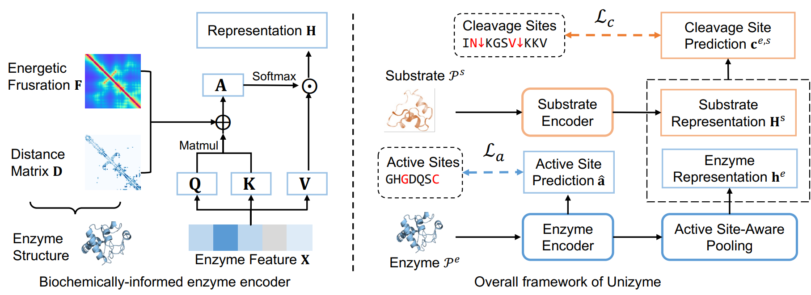

# UniZyme

## Introduction
**UniZyme**: A Unified Protein Cleavage Site Predictor Enhanced with Enzyme Active-Site Knowledge.

This repository contains the code and data for **UniZyme**, a tool designed to predict protein cleavage sites by leveraging enzyme active-site knowledge.



## Data and Model Weights
The datasets and model weights used in the paper can be found at: [Data and Model Weights](https://zenodo.org/records/14795708).

## Dependencies
Follow the steps below to set up the environment for **UniZyme**:

1. **Install Anaconda** or **Miniconda**.
2. Create a new conda environment with the following command:
    ```bash
    conda create -n UniZyme python=3.8
    conda activate UniZyme
    ```
3. Install the required dependencies using the provided `environment.yml` file:
    ```bash
    conda env create -f UniZyme.yml
    ```

## Training
To train the models, use the following scripts:

- **UniZyme** (based on pre-trained models):
    ```bash
    python code/train_UniZyme.py
    ```
- **ReactZyme-Variant**:
    ```bash
    python code/train_ReactZyme-Variant.py
    ```
- **ClipZyme-Variant** (based on enzyme features extracted from ClipZyme):
    ```bash
    python train_ClipZyme-Variant.py
    ```

The output will be generated and saved in the `output_seq` folder as **.csv** files containing the filtered CDR3B sequences.

## Testing the Model
To test the model and obtain prediction results on various benchmarks:
```bash
python code/Test_UniZyme.py
